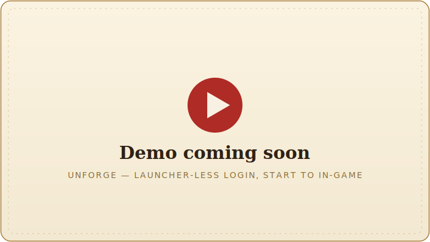

<div align="center">

<picture>
  <source media="(prefers-color-scheme: dark)" srcset="docs/assets/unforge-dark.svg">
  
</picture>

# unforge

**Launch GameForge games without the GameForge launcher.**

[](./LICENSE)
[](https://bun.sh)
[](#what-you-get)
[](./docs/status.md)

</div>

`unforge` reproduces GameForge's `spark.gameforge.com` login itself and hands you a valid game
login code — then, on Windows, spawns the client and logs it in for you. No launcher window, no
Play button. It's a **TypeScript library** and a **single-binary CLI**, so you can drive it from
C++, Python, a script, or a local web UI. Built for **Metin2**, on the GF-account login shared
across GameForge titles.

The point is **launcher-less multibox**: authenticate any number of accounts and drop each one
straight into the game from one command, with a stable, distinct device identity per account.

> [!WARNING]
> **Not a ban bypass.** Skipping the launcher does **not** un-flag an account. `unforge` calls
> the _same_ GameForge APIs the launcher does, so a server-side–flagged account still can't log
> in — the block follows the account, not the launcher, and no local tool clears it. It removes
> the launcher **UI**, not GameForge's checks.

## See it run

<!-- DEMO VIDEO — reserved space.
     To embed: open this file in GitHub's web editor and drag the .mp4 onto the line below;
     GitHub hosts it and turns it into an inline player. Then delete this comment and the
     placeholder image beneath it. -->

<div align="center">
  
</div>

## Quick start

```sh
# 1. Get the binary
#    - download the latest release, or build it yourself:
bun install && bun run build        # → ./unforge (single binary, Windows)

# 2. Point it at your game install (once)
unforge config set game-dir "C:\GameForge\Metin2\pt-PT"

# 3. Link your GameForge account
unforge auth login

# 4. Launch straight into the game
unforge launch <game-account>
```

That last command walks the whole login chain and spawns the client already logged in. Run it
again with another account name to multibox — sessions are reused, so more accounts doesn't mean
more logins.

## What you get

- **One command into the game.** `unforge launch <game-account>` runs the full GameForge login
  chain and spawns the client with the code it mints — no launcher UI in the loop.
- **Multibox from the CLI.** Add every account once, launch any of them by name. The handoff pipe
  is machine-wide and shared by every concurrent client, so many clients run off one flow.
- **A distinct identity per account.** A stable device fingerprint and `InstallationId` are
  generated once per account and persisted — no churn between launches, no correlation across
  accounts.
- **Library-first, in three layers.** `unforge/core` is the reverse-engineering layer (endpoints,
  hashes, the blackbox, the wire protocol — granular and cross-platform), `unforge/storage` is the
  sealed account store, and `unforge` is the complete workflows over both. The CLI is just the
  library with a face on it; `unforge serve` puts a local web UI over the same object.
- **One binary, no runtime.** `bun build --compile` produces a single executable — callable from
  anything that can run a program. The auth half is cross-platform; only `launch` is Windows-only.

### Command surface

| Command                                                      | What it does                                           |
| ------------------------------------------------------------ | ------------------------------------------------------ |
| `unforge launch <game-account>`                              | Auth + spawn the client into a game account (Windows). |
| `unforge account list` · `code <game-account>`               | List your game accounts · mint a one-time login code.  |
| `unforge auth register \| login \| list \| logout \| device` | Manage GameForge accounts and their devices.           |
| `unforge config set game-dir`                                | Point it at your game install, set once.               |
| `unforge serve`                                              | A local web UI over the same store + core.             |

## How it works

Four Spark calls turn credentials into a one-time login code — each depends on the one before it —
and then the client is spawned with it:

```
sessions ──▶ user/accounts ──▶ iovation ──▶ thin/codes ──▶ metin2client.exe
  token       game accounts    device        login code      in game
                               attested        minted
```

The auth half is a plain request/response that runs anywhere Bun runs. The **launch** half is
Windows-only: it spawns `metin2client.exe` from the region's game dir and hands it the code over a
named pipe, which the client reads to log itself in. Because that pipe is a singleton shared by
every concurrent client, `launch` runs as a long-lived server rather than a fire-and-forget spawn.

Full detail in the docs below.

## Status

🚧 **Building in the open.** The full chain works end-to-end — `sessions` → `user/accounts` →
`iovation` → `thin/codes` mints a real Metin2 login code headless, and `unforge launch` spawns the
client and hands it that code, dropping you straight into the game with no launcher in the loop.

**→ [docs/status.md](./docs/status.md)** — exactly what works and what's next.

## Understand how it works

This repo is meant to be as much a **readable explanation of GameForge login** as a tool.
Suggested reading order:

1. [**status.md**](./docs/status.md) — what works, what's blocked, what's next. _Start here._
2. [**design.md**](./docs/design.md) — the shape: the auth/launch split and the library-and-CLI
   principles.
3. [**cli.md**](./docs/cli.md) — the tool you operate: the GameForge-vs-game account vocabulary, the
   command surface, and the per-account device.
4. [**protocol.md**](./docs/protocol.md) — the login flow itself: the Spark calls, account
   creation, the `thin/codes` "MAGIC" hash, and the materials.
5. [**blackbox.md**](./docs/blackbox.md) — the iovation device fingerprint and how we generate it
   natively (no browser).
6. [**handoff.md**](./docs/handoff.md) — the launch half: spawning the client and handing it the
   code over the named pipe.
7. [**capturing-traffic.md**](./docs/capturing-traffic.md) — how we watch the real launcher to
   learn all this (the reverse-engineering loop).
8. [**accounts.md**](./docs/accounts.md) — the storage layer: how accounts are kept (one OS-sealed
   file) for reuse and multibox.
9. [**pow-captcha.md**](./docs/pow-captcha.md) — GameForge's proof-of-work captcha, an intermittent
   gate.
10. [**red-bar.md**](./docs/red-bar.md) — the login block: what's verified, what's folklore, and why
    no local cleanup fixes it.

## Credits / prior art

Protocol knowledge stands on [`morsisko/NosTale-Auth`](https://github.com/morsisko/NosTale-Auth),
[`hatz2/GflessClient`](https://github.com/hatz2/GflessClient), and
[`zakuciael/gf-login`](https://github.com/zakuciael/gf-login). The blackbox reimplementation draws
on [`stdLemon/nostale-auth`](https://github.com/stdLemon/nostale-auth),
[`alaingilbert/ogame`](https://github.com/alaingilbert/ogame), and
[`ogame-ninja/ogame_fingerprint`](https://github.com/ogame-ninja/ogame_fingerprint).

## License

MIT — see [LICENSE](./LICENSE).
